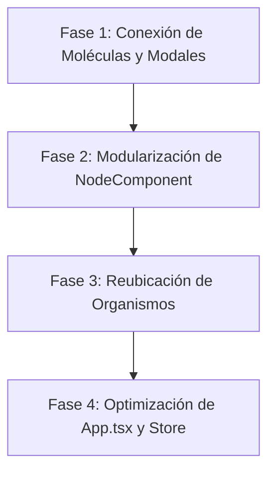

# 🔬 Evaluación Arquitectónica: Limpieza, Estabilidad y Atomic Design

He realizado una lectura y auditoría exhaustiva de todo el código fuente del proyecto (`src/`, `types/`, `hooks/`, `components/`, `utils/` y `doc/`). A continuación presento el dictamen técnico detallado, identificando fortalezas, deuda técnica remanente y la hoja de ruta recomendada para alcanzar el 100% de cumplimiento sin comprometer ninguna funcionalidad ni alterar el diseño visual.

---

## 📊 1. Resumen Ejecutivo de Calificación

| Dimensión | Puntuación | Estado | Observación Principal |
| :--- | :---: | :---: | :--- |
| **Limpieza de Código (Clean Code)** | **7.5 / 10** | 🟡 Bueno | Gran trabajo previo en `ToolPanel` y `useMindMapStore`, pero existen componentes monolíticos (`NodeComponent` con 1,010 líneas y `PresentationMode` con 1,598 líneas), además de prop drilling en `App.tsx`. |
| **Estabilidad y Robustez** | **9.0 / 10** | 🟢 Excelente | Cero errores de TypeScript (`tsc --noEmit` exitoso), build de producción impecable (`vite build` en ~6s), algoritmos matemáticos probados, protección contra ciclos y 40 pasos de Undo/Redo. |
| **Atomic Design** | **6.8 / 10** | 🟡 Parcial | Átomos y Templates bien fundamentados, pero varios organismos (`MenuBar`, `ToolBar`, `MindMapCanvas`, `Modals/`) aún residen fuera de la jerarquía o no consumen los átomos/moléculas existentes. |

---

## 🧼 2. Evaluación de Limpieza del Código (Clean Code)

### ✅ Fortalezas Detectadas
1. **Tipado Estricto y Completo:** [`src/types/mindmap.ts`](file:///d:/admin/OneDrive/Documents/IA-code/FreeplaneWeb/Freemind/src/types/mindmap.ts) define interfaces muy claras para nodos, nubes, conectores, formas, layouts y estilos. No hay abuso de `any`.
2. **Centralización de Estado en Zustand:** [`src/hooks/useMindMapStore.ts`](file:///d:/admin/OneDrive/Documents/IA-code/FreeplaneWeb/Freemind/src/hooks/useMindMapStore.ts) centraliza las operaciones complejas (árbol, mutaciones inmutables, historial con 40 snapshots, copiado/pegado y sincronización con `localStorage`).
3. **Desacoplamiento de Pestañas de Propiedades:** El `ToolPanel` pasó de 5,600 líneas a solo 246 líneas, delegando en 6 organismos limpios (`ContentTab`, `FormatTab`, `NotesTab`, `IconsTab`, `CloudsTab`, `ThemeTab`).

### ⚠️ Deuda Técnica y Oportunidades de Mejora
1. **Componentes "Dios" Monolíticos:**
   - [`NodeComponent.tsx`](file:///d:/admin/OneDrive/Documents/IA-code/FreeplaneWeb/Freemind/src/components/NodeComponent.tsx) (**1,010 líneas**): En un solo archivo conviven cálculos de color/luminancia, generación de 7 patrones SVG inline, 10 formas geométricas, edición de texto inline, renderizado markdown, badges de tags, imágenes, barras de progreso y botones de acción.
   - [`PresentationMode.tsx`](file:///d:/admin/OneDrive/Documents/IA-code/FreeplaneWeb/Freemind/src/components/PresentationMode.tsx) (**1,598 líneas**): Maneja tanto la lógica de temas, diapositivas, modal de configuración, reproductor y HUD en un solo archivo.
   - [`MindMapCanvas.tsx`](file:///d:/admin/OneDrive/Documents/IA-code/FreeplaneWeb/Freemind/src/components/MindMapCanvas.tsx) (**1,445 líneas**): Administra pan/zoom, interacción mouse/touch, arrastre de nodos, selección, conectores y HUD.
2. **Componentes Huérfanos (Creados pero no conectados):**
   - [`ZoomControls.tsx`](file:///d:/admin/OneDrive/Documents/IA-code/FreeplaneWeb/Freemind/src/components/molecules/ZoomControls.tsx): Existe como molécula pero `MindMapCanvas` sigue escribiendo sus propios botones de zoom inline.
   - [`ModalHeader.tsx`](file:///d:/admin/OneDrive/Documents/IA-code/FreeplaneWeb/Freemind/src/components/molecules/ModalHeader.tsx) y [`ModalBackdrop.tsx`](file:///d:/admin/OneDrive/Documents/IA-code/FreeplaneWeb/Freemind/src/components/atoms/ModalBackdrop.tsx): Existen en atoms/molecules, pero los 7 modales en `src/components/Modals/` reescriben manualmente el div del backdrop y el encabezado con `<X />`.
   - [`SearchInput.tsx`](file:///d:/admin/OneDrive/Documents/IA-code/FreeplaneWeb/Freemind/src/components/molecules/SearchInput.tsx) y [`HistoryControls.tsx`](file:///d:/admin/OneDrive/Documents/IA-code/FreeplaneWeb/Freemind/src/components/molecules/HistoryControls.tsx): No se están utilizando en la barra de herramientas.
3. **Prop Drilling en `App.tsx`:**
   - `App.tsx` tiene **703 líneas** porque desempaqueta casi 30 funciones de Zustand para volver a pasarlas como callbacks directos a `MenuBar`, `ToolBar` y `MindMapCanvas`, en lugar de que estos componentes consuman directamente las acciones del store cuando sea oportuno.

---

## 🛡️ 3. Evaluación de Estabilidad y Robustez

### ✅ Puntos Altos de Estabilidad
1. **Compilación y Tipado 100% Limpio:** 
   - `pnpm lint` (`tsc --noEmit`) termina con **cero errores de compilación**.
   - `pnpm build` compila los 1,725 módulos de Vite sin advertencias de tipos ni errores de importación.
2. **Motor de Layout Robusto ([`layoutEngine.ts`](file:///d:/admin/OneDrive/Documents/IA-code/FreeplaneWeb/Freemind/src/utils/layoutEngine.ts)):**
   - Soporta 9 algoritmos de disposición, cálculo de espacio radial/circular con compensación de cuerda (`chordRadius`) y resolución iterativa de colisiones con `resolveLayoutCollisions`.
   - Las pruebas unitarias de `layoutEngine.test.ts` pasan con éxito.
3. **Protección en Mutaciones de Árbol:**
   - En `handleReparentNode` existe detección estricta para evitar ciclos recursivos (un nodo padre no puede convertirse en hijo de su propio descendiente).
   - Generación de IDs únicos (`node-${Date.now()}-${random}`) al clonar subárboles completos.

### ⚠️ Riesgos de Estabilidad a Mitigar
1. **Falta de `ErrorBoundary` de React:** Si un nodo contiene un dato inesperado o un markdown/icono corrupto, podría romper todo el árbol React en blanco. Se recomienda un ErrorBoundary alrededor del lienzo y los modales.
2. **Sincronización `localStorage`:** En mapas masivos con cientos de imágenes en base64, `localStorage` podría alcanzar la cuota de 5MB. Se debe contemplar fallback o aviso si la cuota falla.

---

## 🏛️ 4. Cumplimiento de Principios de Atomic Design

Actualmente el proyecto cuenta con la estructura de carpetas, pero su implementación es **parcial**:

```
src/components/
├── atoms/        (10 componentes)  --> ✅ Bien implementados (Button, Input, Badge, SliderInput...)
├── molecules/    (7 componentes)   --> 🟡 Bien diseñados, pero varios sin conectar
├── organisms/    (3 subdirectorios)--> 🟡 ToolPanel excelente; Canvas y Presentation a medio camino
├── templates/    (1 layout)        --> ✅ MainEditorLayout estructura bien la interfaz
└── [Directos]    (10 componentes)  --> 🔴 MenuBar, ToolBar, MindMapCanvas, Modals... están en la raíz
```

### Clasificación Detallada por Nivel

| Nivel Atomic | Estado Actual | Componentes Existentes | Diagnóstico y Acción Recomendada |
| :--- | :---: | :--- | :--- |
| **Átomos** | **85%** | `Button`, `IconButton`, `Input`, `Badge`, `ColorPicker`, `SliderInput`, `ToggleButton`, `ToggleButtonGroup`, `CollapsibleSection`, `ModalBackdrop`. | **Excelente base.** Falta asegurar que los modales y barras usen estos botones e inputs en vez de elementos nativos con clases repetidas. |
| **Moléculas** | **60%** | `FontFormatToolbar`, `ShapeSelector`, `TagManager`, `ModalHeader`, `ZoomControls`, `SearchInput`, `HistoryControls`. | **Subutilizadas.** Conectar `ModalHeader` en todos los modales y `ZoomControls` en el canvas. Extraer de `NodeComponent`: `NodeTitleEdit`, `NodeActions`, `NodeBadgesBar`. |
| **Organismos** | **65%** | `toolpanel/*` (`ContentTab`, `FormatTab`...), `canvas/*` (`CanvasBackgroundLayer`, `CanvasContextMenu`, `CanvasPresentationHUD`...). | **En transición.** Mover a `organisms/`: `MenuBar`, `ToolBar`, `FilterBar`, `StatusBar`, `OutlineView`, y la carpeta `Modals/` completa (`organisms/modals/`). |
| **Templates** | **90%** | `MainEditorLayout.tsx`. | **Cumple el principio.** Define los slots para barra superior, herramientas, área principal, panel lateral y barra de estado. |
| **Páginas** | **70%** | `App.tsx`. | **Funciona como orquestador.** Puede aligerarse de 703 líneas a ~200 líneas delegando el estado de modales y conectando componentes al store de Zustand. |

---

## 🗺️ 5. Hoja de Ruta Sugerida (Plan de Refactorización Segura)

Para dejar el código **completamente limpio, estable y 100% alineado a Atomic Design** sin tocar ni dañar la estética actual:



### Fase 1: Adopción de Átomos y Moléculas Existentes
- Reemplazar en los 7 modales el código repetido por `ModalBackdrop` y `ModalHeader`.
- Conectar `ZoomControls` en `MindMapCanvas`.
- **Riesgo:** Cero. Mantiene exactamente las mismas clases Tailwind y eventos.

### Fase 2: Descomposición de `NodeComponent.tsx` (1,010 líneas ➔ ~180 líneas)
- Extraer a `molecules/node/`:
  1. `NodeBackgroundRenderer.tsx` (cálculo de colores, gradientes y patrones SVG).
  2. `NodeHeaderRow.tsx` (iconos + título editable).
  3. `NodeBadgesBar.tsx` (link badge, tags y barra de progreso).
  4. `NodeActionButtons.tsx` (botón de plegar/desplegar, añadir hijo, drag handle).
- **Riesgo:** Mínimo. Cada subcomponente recibe las mismas props de solo lectura.

### Fase 3: Jerarquía Limpia de Organismos
- Mover a `src/components/organisms/`:
  - `navigation/MenuBar.tsx`
  - `navigation/ToolBar.tsx`
  - `navigation/StatusBar.tsx`
  - `canvas/MindMapCanvas.tsx`
  - `modals/*`
- Actualizar las rutas de importación correspondientes.

### Fase 4: Desacoplamiento de `App.tsx`
- Reducir el paso manual de propiedades (`prop drilling`) permitiendo que los organismos lean y despachen directamente sobre `useMindMapStore`.
- Añadir un `ErrorBoundary` global para blindar la app contra fallos imprevistos de renderizado.

---

### Conclusión
El proyecto tiene una **base funcional y visual de primer nivel**: los algoritmos de mapas, exportación y estilos funcionan sólidamente. Con las 4 fases anteriores se eliminará la deuda técnica restante, consolidando una arquitectura limpia, modular y fácil de mantener a largo plazo.

¿Deseas que preparemos el plan formal de ejecución para iniciar con alguna de estas fases?