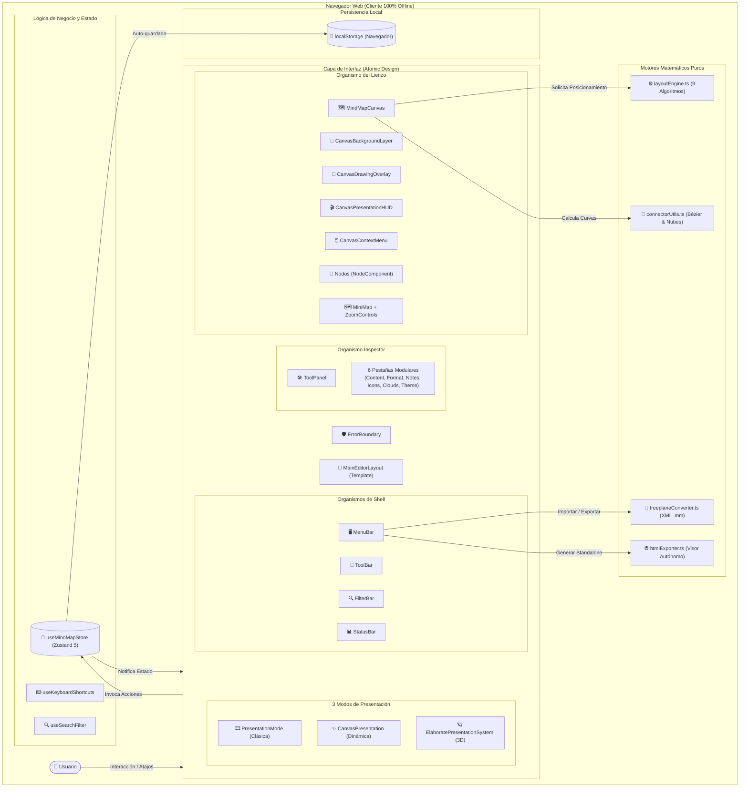
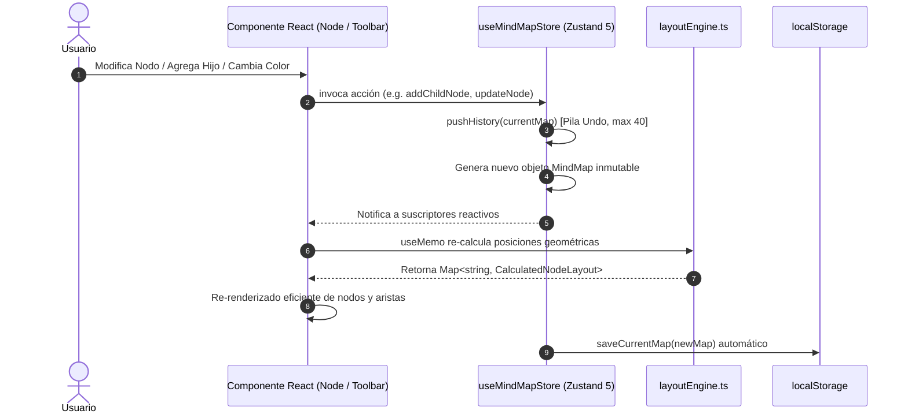
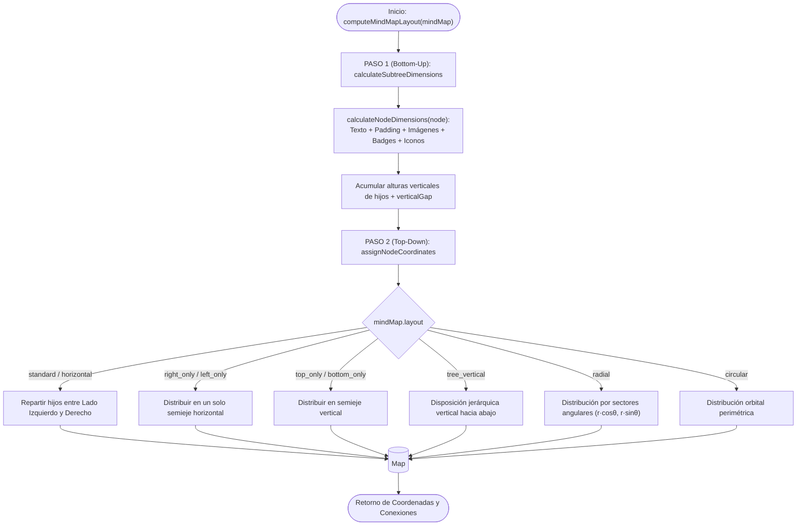
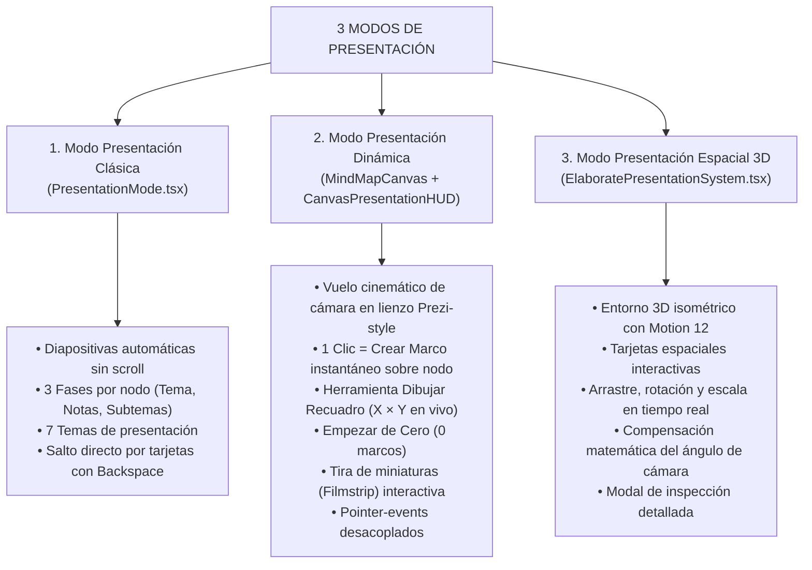
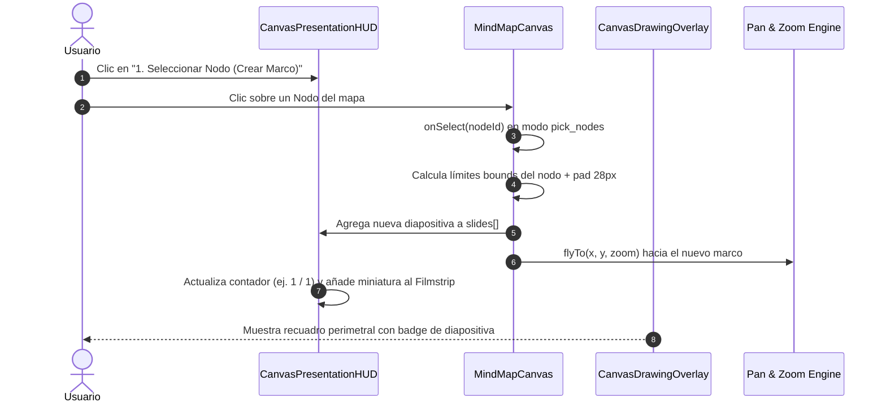
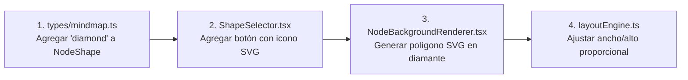

# 🧠 FreeMind Map Studio — Documento Maestro de Arquitectura de Software

**Versión:** 3.0  
**Fecha:** Septiembre 2026  
**Tecnologías Principales:** React 19 · TypeScript 5.8 · Vite 6 · Tailwind CSS v4 · Zustand 5 · Vitest 4 · Motion 12  
**Gestor de Paquetes:** pnpm  
**Persistencia:** `localStorage` (100% Offline, sin servidores, privacidad absoluta)  
**Patrones de Diseño:** Atomic Design + Store Unidireccional Reactivo (Zustand) + Inmutabilidad Funcional + Error Boundaries  

---

## 📑 Tabla de Contenidos

1. [Visión General del Sistema y Ficha Técnica](#1-visión-general-del-sistema-y-ficha-técnica)
2. [Arquitectura Atomic Design (4 Niveles)](#2-arquitectura-atomic-design-4-niveles)
   - 2.1. [Nivel 4 — Templates (`MainEditorLayout.tsx`)](#21-nivel-4--templates-maineditorlayouttsx)
   - 2.2. [Nivel 3 — Organismos (Canvas, ToolPanel, Shell, Modales)](#22-nivel-3--organismos)
   - 2.3. [Nivel 2 — Moléculas (Controles y Sub-moléculas de Nodo)](#23-nivel-2--moléculas)
   - 2.4. [Nivel 1 — Átomos (Primitivos UI y ErrorBoundary)](#24-nivel-1--átomos)
3. [Flujo de Datos y Estado Global con Zustand](#3-flujo-de-datos-y-estado-global-con-zustand)
   - 3.1. [Estructura del Store (`useMindMapStore.ts`)](#31-estructura-del-store-usemindmapstorets)
   - 3.2. [Historial Inmutable Undo/Redo](#32-historial-inmutable-undoredo)
   - 3.3. [Propagación de Estilos vs Propagación de Iconos](#33-propagación-de-estilos-vs-propagación-de-iconos)
   - 3.4. [Hooks Desacoplados (Atajos y Filtros)](#34-hooks-desacoplados-atajos-y-filtros)
4. [Motor Matemático de Layout y Geometría (`layoutEngine.ts`)](#4-motor-matemático-de-layout-y-geometría-layoutenginets)
   - 4.1. [Algoritmo de 2 Pasadas (Bottom-Up & Top-Down)](#41-algoritmo-de-2-pasadas-bottom-up--top-down)
   - 4.2. [Los 9 Algoritmos de Distribución Geométrica](#42-los-9-algoritmos-de-distribución-geométrica)
   - 4.3. [Cálculo de Conectores Flotantes y Nubes](#43-cálculo-de-conectores-flotantes-y-nubes)
5. [Los 3 Sistemas de Presentación](#5-los-3-sistemas-de-presentación)
   - 5.1. [Sistema 1: Presentación Clásica en Diapositivas](#51-sistema-1-presentación-clásica-en-diapositivas)
   - 5.2. [Sistema 2: Presentación Dinámica en Lienzo (Prezi-Style)](#52-sistema-2-presentación-dinámica-en-lienzo-prezi-style)
   - 5.3. [Sistema 3: Presentación Espacial 3D](#53-sistema-3-presentación-espacial-3d)
6. [Interoperabilidad, Exportación y Almacenamiento](#6-interoperabilidad-exportación-y-almacenamiento)
   - 6.1. [Conversor Freeplane XML (`.mm`)](#61-conversor-freeplane-xml-mm)
   - 6.2. [Exportador HTML Autónomo y Formatos Vectoriales](#62-exportador-html-autónomo-y-formatos-vectoriales)
   - 6.3. [Estrategia de Persistencia Local](#63-estrategia-de-persistencia-local)
7. [Infraestructura de Pruebas y Calidad de Código](#7-infraestructura-de-pruebas-y-calidad-de-código)
8. [Matriz Código a Código del Repositorio](#8-matriz-código-a-código-del-repositorio)
9. [Anatomía Visual de un Nodo y Mapeo a Código](#9-anatomía-visual-de-un-nodo-y-mapeo-a-código)
10. [Guía Práctica de Extensión para Desarrolladores ("Cookbook")](#10-guía-práctica-de-extensión-para-desarrolladores-cookbook)
   - 10.1. [Tutorial 1: Cómo Añadir Más Opciones al Título de un Nodo](#-tutorial-1-cómo-añadir-más-opciones-al-título-de-un-nodo)
   - 10.2. [Tutorial 2: Cómo Modificar la Interfaz de las Presentaciones](#-tutorial-2-cómo-modificar-la-interfaz-de-las-presentaciones)
   - 10.3. [Tutorial 3: Cómo Añadir una Nueva Forma de Nodo (Rombo/Diamante)](#-tutorial-3-cómo-añadir-una-nueva-forma-de-nodo-ejemplo-diamante--rombo)
   - 10.4. [Tutorial 4: Conversión de Coordenadas de Pantalla a Mundo en el Canvas](#-tutorial-4-conversión-de-coordenadas-de-pantalla-a-mundo-en-el-canvas)
   - 10.5. [Tutorial 5: Cómo Cambiar el Color de Fondo del MiniMapa](#-tutorial-5-cómo-cambiar-el-color-de-fondo-del-minimapa)


---

## 1. Visión General del Sistema y Ficha Técnica

FreeMind Map Studio es una suite de mapas mentales y presentaciones interactivas de grado profesional diseñada para ejecutarse íntegramente en el navegador web cliente. No requiere servidores centrales, bases de datos remotas ni autenticación de usuarios. 

### Principios Rectores de Diseño:
1. **100% Offline y Privacidad Absoluta**: Toda la información reside en la máquina del usuario (`localStorage` y descargas de archivos locales).
2. **Cero Dependencias Externas en Exportables**: El exportador HTML genera un visor interactivo autónomo con SVG embebido, operable sin conexión a internet.
3. **Inmutabilidad y Robustez Funcional**: Cada operación sobre el árbol genera nuevas referencias inmutables, permitiendo un historial de Deshacer/Rehacer de 40 estados sin efectos secundarios.
4. **Desacoplamiento Estricto (Atomic Design)**: La interfaz está descompuesta en Átomos, Moléculas, Organismos y Templates, eliminando componentes monolíticos.
5. **Tipado Estricto de Extremo a Extremo**: Cero errores en `tsc --noEmit` con React 19 y TypeScript 5.8.



---

## 2. Arquitectura Atomic Design (4 Niveles)

El proyecto organiza sus componentes visuales siguiendo estrictamente la metodología **Atomic Design**, garantizando que cada pieza tenga una responsabilidad delimitada y una alta reutilización.

```mermaid
graph TD
    subgraph Nivel4["NIVEL 4 — TEMPLATES"]
        T1["MainEditorLayout.tsx"]
    end

    subgraph Nivel3["NIVEL 3 — ORGANISMOS"]
        O1["MindMapCanvas.tsx"]
        O2["ToolPanel.tsx (6 Tabs)"]
        O3["MenuBar.tsx & ToolBar.tsx"]
        O4["PresentationMode.tsx"]
        O5["ElaboratePresentationSystem.tsx"]
        O6["7 Modales Estandarizados"]
        O7["CanvasBackgroundLayer.tsx"]
        O8["CanvasDrawingOverlay.tsx"]
        O9["CanvasPresentationHUD.tsx"]
    end

    subgraph Nivel2["NIVEL 2 — MOLÉCULAS"]
        M1["ModalHeader.tsx"]
        M2["SearchInput.tsx"]
        M3["HistoryControls.tsx"]
        M4["ZoomControls.tsx"]
        M5["FontFormatToolbar.tsx"]
        M6["ShapeSelector.tsx"]
        M7["TagManager.tsx"]
        subgraph NodeMolecules["Moléculas de NodeComponent"]
            M8["NodeBackgroundRenderer.tsx"]
            M9["NodeHeaderRow.tsx"]
            M10["NodeBadgesBar.tsx"]
            M11["NodeActionButtons.tsx"]
        end
    end

    subgraph Nivel1["NIVEL 1 — ÁTOMOS"]
        A1["Button.tsx"]
        A2["IconButton.tsx"]
        A3["Input.tsx"]
        A4["Badge.tsx"]
        A5["ModalBackdrop.tsx"]
        A6["ErrorBoundary.tsx"]
        A7["CollapsibleSection.tsx"]
        A8["ColorPicker.tsx"]
        A9["SliderInput.tsx"]
        A10["ToggleButton.tsx"]
        A11["ToggleButtonGroup.tsx"]
    end

    T1 --> O1 & O2 & O3 & O4 & O5 & O6
    O1 --> O7 & O8 & O9 & M8 & M9 & M10 & M11 & M4
    O2 --> M5 & M6 & M7 & A7 & A8 & A9 & A10 & A11
    O6 --> M1 & A5 & A1 & A3
    M1 --> A2
    M2 --> A3 & A2
    M3 --> A2
    M4 --> A2
    M7 --> A4 & A3 & A2
```



---

### 2.1. Nivel 4 — Templates (`MainEditorLayout.tsx`)

`MainEditorLayout` orquesta la disposición espacial de la aplicación dividiéndola en slots (`slots`) declarativos:
- **Barra Superior**: `menuBar` y `toolBar`.
- **Barra de Búsqueda Desplegable**: `filterBar` (condicional a `isFilterBarOpen`).
- **Área Central de Trabajo**:
  - Panel izquierdo colapsable: `outlineView` (`isOutlineOpen`).
  - Lienzo central: `canvas` (ocupa el 100% del espacio restante).
  - Panel lateral derecho: `toolPanel` (inspector de 6 pestañas, `isToolPanelOpen`).
- **Barra de Estado Inferior**: `statusBar`.
- **Capa Flotante de Modales**: `modals`.
- **Overlay de Presentación Pantalla Completa**: `presentationOverlay`.

Gracias a este template, [`src/App.tsx`](file:///d:/admin/OneDrive/Documents/IA-code/FreeplaneWeb/Freemind/src/App.tsx) se mantiene como un orquestador conciso envuelto en [`src/components/atoms/ErrorBoundary.tsx`](file:///d:/admin/OneDrive/Documents/IA-code/FreeplaneWeb/Freemind/src/components/atoms/ErrorBoundary.tsx), garantizando que cualquier fallo inesperado en un subcomponente muestre una pantalla de recuperación con opción de recarga sin pérdida de datos en `localStorage`.

---

### 2.2. Nivel 3 — Organismos

Los organismos son estructuras complejas que combinan moléculas y átomos para resolver flujos de usuario completos.

#### A. Descomposición del Lienzo (`MindMapCanvas.tsx`)
El lienzo infinito delega sus responsabilidades en 4 sub-organismos desacoplados:
1. [`CanvasBackgroundLayer.tsx`](file:///d:/admin/OneDrive/Documents/IA-code/FreeplaneWeb/Freemind/src/components/organisms/canvas/CanvasBackgroundLayer.tsx): Renderiza de manera ultrarrápida los 12 fondos del lienzo (cuadernos de puntos, mallas milimetradas, planos blueprint, paneles hexagonales y tramas cibernéticas) mediante patrones SVG nativos con `transform: translate3d`.
2. [`CanvasDrawingOverlay.tsx`](file:///d:/admin/OneDrive/Documents/IA-code/FreeplaneWeb/Freemind/src/components/organisms/canvas/CanvasDrawingOverlay.tsx): 
   - Dibuja en vivo el recuadro interactivo punteado azul durante el arrastre con la herramienta **Dibujar Recuadro**, mostrando dimensiones en píxeles (`Ancho × Alto`).
   - Renderiza las etiquetas escalonadas de las diapositivas existentes.
   - Aplica `pointer-events-none` sobre el cuerpo transparente de los marcos para que **nunca bloqueen los clics dirigidos a los nodos** situados debajo.
3. [`CanvasPresentationHUD.tsx`](file:///d:/admin/OneDrive/Documents/IA-code/FreeplaneWeb/Freemind/src/components/organisms/canvas/CanvasPresentationHUD.tsx): Barra flotante superior e inferior de la Presentación Dinámica:
   - Alternancia entre modo **Editor de Marcos** y **Presentar (F5)**.
   - Herramientas: `1. Seleccionar Nodo (Crear Marco)`, `2. Dibujar Recuadro` y `Navegar / Mover`.
   - Botón **Empezar de Cero** para limpiar el mapa a 0 diapositivas.
   - Tira inferior (*Filmstrip*) interactiva con miniaturas, botones de salto y eliminación.
4. [`CanvasContextMenu.tsx`](file:///d:/admin/OneDrive/Documents/IA-code/FreeplaneWeb/Freemind/src/components/organisms/canvas/CanvasContextMenu.tsx): Menú contextual al hacer clic derecho sobre cualquier nodo o fondo del lienzo, con accesos directos a crear hijo, hermano, clonar, cortar, copiar, pegar, crear nubes y cambiar formas.

#### B. Descomposición del Inspector (`ToolPanel.tsx`)
El panel lateral derecho se compone de 6 pestañas independientes alojadas en `src/components/organisms/toolpanel/`:
- `ContentTab.tsx`: Título, cuerpo multilínea, alineación tipográfica e imágenes adjuntas con 7 posiciones (`top`, `bottom`, `left`, `right`, `between`, `background`, `fit`).
- `FormatTab.tsx`: Geometría de forma (10 opciones), fondo (color, degradados en 4 direcciones, 8 tramas SVG e imagen de fondo), bordes (grosor, color, estilos sólido/discontinuo/punteado) y estilos de arista hacia hijos.
- `NotesTab.tsx`: Editor de notas Markdown enriquecido, hipervínculos web y barra de progreso (0% a 100%).
- `IconsTab.tsx`: Catálogo temático de iconos vectoriales interactivos con tinte SVG y escala personalizada.
- `CloudsTab.tsx`: Activación de nubes de agrupación sobre el sub-árbol, selección de 4 geometrías y selector de color RGBA con transparencia.
- `ThemeTab.tsx`: Selector visual de los 9 temas integrados, los 9 algoritmos de layout geométrico y los 12 fondos de lienzo.

#### C. Modales Estandarizados
Los 7 diálogos modales (`ExportImportModal`, `ShortcutsModal`, `TemplatesModal`, `SavedMapsModal`, `ConnectorModal`, `IconPackModal`, `ComingSoonModal`) implementan la misma base:
- `ModalBackdrop` (átomo): Bloqueo visual con desenfoque de fondo (`backdrop-blur-sm`).
- `ModalHeader` (molécula): Icono temático, título descriptivo, subtítulo y botón de cierre unificado con tecla `Escape`.

---

### 2.3. Nivel 2 — Moléculas

Las moléculas agrupan átomos con una finalidad funcional específica:
- [`ZoomControls.tsx`](file:///d:/admin/OneDrive/Documents/IA-code/FreeplaneWeb/Freemind/src/components/molecules/ZoomControls.tsx): Control unificado de acercar (`+`), alejar (`-`), reset a 100% y auto-centrado (`Ctrl+0`). Se utiliza tanto en la barra flotante del lienzo como dentro del `MiniMap`.
- [`HistoryControls.tsx`](file:///d:/admin/OneDrive/Documents/IA-code/FreeplaneWeb/Freemind/src/components/molecules/HistoryControls.tsx): Botones de Deshacer y Rehacer con indicación de atajos de teclado y conteo de pila.
- [`SearchInput.tsx`](file:///d:/admin/OneDrive/Documents/IA-code/FreeplaneWeb/Freemind/src/components/molecules/SearchInput.tsx): Input estilizado con icono de lupa, foco automático y botón de limpieza inmediata (`✕`).
- [`ModalHeader.tsx`](file:///d:/admin/OneDrive/Documents/IA-code/FreeplaneWeb/Freemind/src/components/molecules/ModalHeader.tsx): Encabezado de modales con tipografía de alto contraste.

#### Modularización de `NodeComponent.tsx`
El renderizador de nodos (`NodeComponent.tsx`) fue refactorizado pasando de un monolito de más de 1,000 líneas a un orquestador declarativo de 180 líneas respaldado por 4 moléculas especializadas:
1. [`NodeBackgroundRenderer.tsx`](file:///d:/admin/OneDrive/Documents/IA-code/FreeplaneWeb/Freemind/src/components/molecules/node/NodeBackgroundRenderer.tsx):
   - Generación matemática de polígonos SVG para formas complejas: **Hexágono** (6 vértices con corte simétrico), **Flecha de Dirección** (cuerpo rectangular con punta triangular) y **Estrella de 5 puntas**.
   - Renderizado de la **Cola de Burbuja de Diálogo (`bubble`)**: Dibuja una punta exterior SVG que conecta limpiamente el nodo con su rama padre.
   - Detección de luminancia de fondo (`isDarkNodeBackground`) para conmutar automáticamente el contraste del texto entre blanco y negro.
2. [`NodeHeaderRow.tsx`](file:///d:/admin/OneDrive/Documents/IA-code/FreeplaneWeb/Freemind/src/components/molecules/node/NodeHeaderRow.tsx):
   - Fila superior e interior del nodo: imagen adjunta en posición superior/izquierda, indicadores de progreso circulares y píldoras, iconos vectoriales y visualizador de título.
   - Textarea inline interactivo con auto-enfoque al pulsar `F2` o hacer doble clic.
3. [`NodeBadgesBar.tsx`](file:///d:/admin/OneDrive/Documents/IA-code/FreeplaneWeb/Freemind/src/components/molecules/node/NodeBadgesBar.tsx):
   - Insignias de metadatos: chips de tags interactivos, indicador de hipervínculo con apertura externa segura (`target="_blank" rel="noopener noreferrer"`), y badge de Nota Markdown con previsualización en tooltip o drawer.
4. [`NodeActionButtons.tsx`](file:///d:/admin/OneDrive/Documents/IA-code/FreeplaneWeb/Freemind/src/components/molecules/node/NodeActionButtons.tsx):
   - Píldora de plegado/desplegado de rama (`folded`) con conteo de hijos ocultos.
   - Botón flotante `+` para agregar hijos instantáneos mediante clic.
   - Asa de arrastre (*Drag Handle*) para re-parentar nodos con protección anti-ciclos.

---

### 2.4. Nivel 1 — Átomos

Componentes base sin lógica de negocio, estilizados con Tailwind CSS y altamente testeados:
- [`Button.tsx`](file:///d:/admin/OneDrive/Documents/IA-code/FreeplaneWeb/Freemind/src/components/atoms/Button.tsx): Variantes `primary`, `secondary`, `danger`, `ghost`, con soporte para estados de carga (`isLoading`) e iconos.
- [`IconButton.tsx`](file:///d:/admin/OneDrive/Documents/IA-code/FreeplaneWeb/Freemind/src/components/atoms/IconButton.tsx): Botón cuadrado o circular compacto para barras de herramientas con tooltips nativos.
- [`Input.tsx`](file:///d:/admin/OneDrive/Documents/IA-code/FreeplaneWeb/Freemind/src/components/atoms/Input.tsx): Campo de texto con estilos de foco accesibles (`ring-2 ring-blue-500`).
- [`Badge.tsx`](file:///d:/admin/OneDrive/Documents/IA-code/FreeplaneWeb/Freemind/src/components/atoms/Badge.tsx): Píldora de estado con variantes cromáticas (`default`, `primary`, `success`, `warning`, `danger`).
- [`ModalBackdrop.tsx`](file:///d:/admin/OneDrive/Documents/IA-code/FreeplaneWeb/Freemind/src/components/atoms/ModalBackdrop.tsx): Capa oscura translúcida con cierre por clic exterior.
- [`ErrorBoundary.tsx`](file:///d:/admin/OneDrive/Documents/IA-code/FreeplaneWeb/Freemind/src/components/atoms/ErrorBoundary.tsx): Componente de clase React que captura fallos en tiempo de ejecución en cualquier nivel del árbol.
- [`ColorPicker.tsx`](file:///d:/admin/OneDrive/Documents/IA-code/FreeplaneWeb/Freemind/src/components/atoms/ColorPicker.tsx): Paleta de colores preestablecidos con selector nativo y validación hexadecimal.
- [`SliderInput.tsx`](file:///d:/admin/OneDrive/Documents/IA-code/FreeplaneWeb/Freemind/src/components/atoms/SliderInput.tsx): Control deslizante sincronizado bidireccionalmente con un input numérico.
- [`ToggleButton.tsx`](file:///d:/admin/OneDrive/Documents/IA-code/FreeplaneWeb/Freemind/src/components/atoms/ToggleButton.tsx) y [`ToggleButtonGroup.tsx`](file:///d:/admin/OneDrive/Documents/IA-code/FreeplaneWeb/Freemind/src/components/atoms/ToggleButtonGroup.tsx): Interruptores visuales para opciones exclusivas.
- [`CollapsibleSection.tsx`](file:///d:/admin/OneDrive/Documents/IA-code/FreeplaneWeb/Freemind/src/components/atoms/CollapsibleSection.tsx): Contenedor de acordeón con cabecera interactiva y animación de despliegue.

---

## 3. Flujo de Datos y Estado Global con Zustand

El estado de la aplicación sigue una arquitectura **unidireccional y reactiva** impulsada por Zustand 5, garantizando que el mapa mental tenga una única fuente de verdad inmutable.



### 3.1. Estructura del Store (`useMindMapStore.ts`)

El store centraliza las siguientes piezas clave de estado:

```typescript
interface MindMapStoreState {
  // 1. Estado del Mapa Mental
  mindMap: MindMap;
  setMindMap: (map: MindMap) => void;
  
  // 2. Historial Inmutable
  historyPast: MindMap[];
  historyFuture: MindMap[];
  pushHistory: (map: MindMap) => void;
  handleUndo: () => void;
  handleRedo: () => void;
  
  // 3. Foco y Selección
  selectedNodeId: string | null;
  setSelectedNodeId: (id: string | null) => void;
  editingNodeId: string | null;
  setEditingNodeId: (id: string | null) => void;
  focusTarget: { id: string; timestamp: number } | null;
  triggerFocusNode: (id: string) => void;
  
  // 4. Portapapeles Inteligente
  clipboard: { node: MindNode; subtree: Record<string, MindNode> } | null;
  copyNode: (id: string) => void;
  cutNode: (id: string) => void;
  pasteNode: (targetParentId: string) => void;
  
  // 5. Visibilidad de Paneles
  isOutlineOpen: boolean;
  isOutlineFullscreen: boolean;
  isToolPanelOpen: boolean;
  isFilterBarOpen: boolean;
  isPresentationMode: boolean;
  presentationType: 'classic' | 'canvas' | 'elaborate';
}
```

### 3.2. Historial Inmutable Undo/Redo

Cada mutación sobre el árbol invoca `pushHistory(currentMap)` antes de aplicar el cambio:
- La pila de `historyPast` almacena hasta **40 instantáneas completas**.
- Al invocar `handleUndo()`, el mapa actual se desplaza a `historyFuture` y el estado anterior se restaura instantáneamente.
- La inmutabilidad garantiza que los nodos compartidos no sufran mutaciones por referencia, previniendo estados inconsistentes o bucles infinitos en React.

### 3.3. Propagación de Estilos vs Propagación de Iconos

El store desacopla deliberadamente la propagación de diseño para no sobreescribir datos no deseados:
1. **`applyStyleToChildren` / `applyStyleToSiblings`**:
   - Extrae el paquete de diseño `extractNodeStyleBundle` (forma, colores, degradados, tramas, imagen de fondo, bordes, tipografía).
   - Lo aplica en cascada respetando los textos, notas, tags y enlaces de cada nodo descendiente.
2. **`applyIconsToChildren` / `applyIconsToSiblings`**:
   - Propaga exclusivamente el conjunto de iconos vectoriales, tamaño y tinte, sin alterar los estilos geométricos ni los fondos de los nodos.

### 3.4. Hooks Desacoplados (Atajos y Filtros)

- [`useKeyboardShortcuts.ts`](file:///d:/admin/OneDrive/Documents/IA-code/FreeplaneWeb/Freemind/src/hooks/useKeyboardShortcuts.ts): Registra un único oyente global en `window` que intercepta atajos de teclado estándar de Freeplane (`Tab`, `Enter`, `F2`, `Supr`, `Espacio`, `Ctrl+Z`, `Ctrl+Y`, `Ctrl+C`, `Ctrl+V`, `Ctrl+F`, `F5`). Ignora pulsaciones si el usuario está escribiendo en un input, textarea o modal.
- [`useSearchFilter.ts`](file:///d:/admin/OneDrive/Documents/IA-code/FreeplaneWeb/Freemind/src/hooks/useSearchFilter.ts): Evalúa en tiempo real criterios acumulativos de filtrado (búsqueda textual, tags, rango de progreso, iconos, notas y links) y genera un `Set<string>` con los IDs de los nodos coincidentes, con opción de incluir ancestros o descendientes.

---

## 4. Motor Matemático de Layout y Geometría (`layoutEngine.ts`)

El motor de layout es una biblioteca matemática pura sin dependencias de DOM que calcula las coordenadas `(x, y)` y dimensiones de cada nodo del mapa mental.



### 4.1. Algoritmo de 2 Pasadas (Bottom-Up & Top-Down)

1. **Pasada 1 (Bottom-Up — Medición y Acumulación)**:
   - Recorre recursivamente el árbol desde las hojas hacia la raíz.
   - En cada nodo, calcula su ancho y alto mediante `calculateNodeDimensions`, considerando longitud de texto, tamaño de fuente, imágenes adjuntas, badges de tags y notas.
   - Suma las alturas de sus sub-árboles hijos más el espaciado vertical (`verticalGap`).
2. **Pasada 2 (Top-Down — Asignación de Coordenadas)**:
   - Fija la raíz en el origen `(0, 0)`.
   - Distribuye a los hijos ordenadamente en el plano cartesiano según el algoritmo de layout elegido, sumando el espaciado horizontal (`horizontalGap`).

### 4.2. Los 9 Algoritmos de Distribución Geométrica

| # | Layout | Comportamiento Geométrico |
|---|--------|---------------------------|
| 1 | `standard` | **Bifurcado Clásico:** Alterna ramas principales entre la derecha y la izquierda de la raíz para un equilibrio visual idéntico al de Freeplane. |
| 2 | `horizontal` | **Horizontal Balanceado:** Asigna ramas a derecha o izquierda de forma codiciosa (*greedy*) calculando la suma de alturas de sub-árboles para minimizar la disparidad vertical. |
| 3 | `right_only` | Todas las ramas se proyectan exclusivamente hacia la derecha (`+X`). Ideal para diagramas cronológicos o flujos de causa-efecto. |
| 4 | `left_only` | Todas las ramas se proyectan hacia la izquierda (`-X`). |
| 5 | `bottom_only` | Proyección hacia abajo (`+Y`). |
| 6 | `top_only` | Proyección hacia arriba (`-Y`). |
| 7 | `tree_vertical` | **Árbol Organizacional:** Distribución jerárquica descendente donde los hijos se centran horizontalmente debajo de su padre directo. |
| 8 | `radial` | **Radial Continuo:** Distribuye los nodos en anillos concéntricos calculando ángulos polares: $X = r \cdot \cos(\theta)$, $Y = r \cdot \sin(\theta)$. |
| 9 | `circular` | **Orbital Perimétrico:** Posiciona los nodos hijos en el perímetro de una circunferencia perfecta alrededor del nodo raíz. |

### 4.3. Cálculo de Conectores Flotantes y Nubes

- **Aristas de Rama (`generateEdgePath` / `generateRibbonEdgePath`)**:
  - Curvas de Bézier cúbicas con puntos de control horizontales basados en la distancia entre nodos:
    $$\mathbf{C}_1 = (X_{padre} + \Delta X \cdot 0.5, Y_{padre}), \quad \mathbf{C}_2 = (X_{padre} + \Delta X \cdot 0.5, Y_{hijo})$$
  - Soporta 4 perfiles de trazado: **Uniforme** (grosor constante), **Cónico / Tapered** (grueso en la base y fino en el nodo destino), **Huso / Spindle** (grueso en el centro) y **Reloj de Arena**.
- **Conectores Cruzados Flotantes ([`src/utils/connectorUtils.ts`](file:///d:/admin/OneDrive/Documents/IA-code/FreeplaneWeb/Freemind/src/utils/connectorUtils.ts))**:
  - Calcula las intersecciones perimetrales entre las cajas delimitadoras de cualquier par de nodos arbitrarios.
  - Genera flechas en extremos (`start`, `end`, `both`), etiquetas intermedias y estilos de curva (Bézier, recta o en ángulo ortogonal `step`).
- **Nubes de Agrupación ([`computeCloudBounds`](file:///d:/admin/OneDrive/Documents/IA-code/FreeplaneWeb/Freemind/src/utils/layoutEngine.ts))**:
  - Calcula la envolvente convexa del sub-árbol completo con margen perimetral y genera trazados SVG ondulados o poligonales con fondo traslúcido.

---

## 5. Los 3 Sistemas de Presentación



### 5.1. Sistema 1: Presentación Clásica en Diapositivas

Implementado en [`src/components/PresentationMode.tsx`](file:///d:/admin/OneDrive/Documents/IA-code/FreeplaneWeb/Freemind/src/components/PresentationMode.tsx), convierte automáticamente la jerarquía del mapa mental en una presentación de diapositivas limpias y elegantes:

```
Flujo de Fases para cada Nodo:
┌─────────────────────────────────────┐
│  FASE 1 — Tema Principal            │  ← Siempre presente
│  🖼️ Imagen + Título + Cuerpo        │  ← Paginación automática si el texto es extenso
└──────────────────┬──────────────────┘
                   │
┌──────────────────▼──────────────────┐
│  FASE 2 — Notas del Presentador     │  ← Si el nodo contiene notas Markdown
│  Markdown enriquecido renderizado   │  ← Paginación inteligente (~9 líneas por diapositiva)
└──────────────────┬──────────────────┘
                   │
┌──────────────────▼──────────────────┐
│  FASE 3 — Subtemas / Hijos          │  ← Grid de tarjetas interactivas (máximo 6 por slide)
│  [Card A] [Card B] [Card C]         │  ← Clic en tarjeta = Salto inmediato al nodo
│  [Card D] [Card E] [Card F]         │  ← Tecla Backspace = Vuelve al nodo de origen
└─────────────────────────────────────┘
```

- **7 Temas de Presentación:** Estudio Oscuro, Medianoche OLED, Cyberpunk Neón, Azul Ejecutivo, Bosque Esmeralda, Atardecer y Luz Minimalista.

---

### 5.2. Sistema 2: Presentación Dinámica en Lienzo (Prezi-Style)

Opera directamente sobre el lienzo infinito mediante [`CanvasPresentationHUD.tsx`](file:///d:/admin/OneDrive/Documents/IA-code/FreeplaneWeb/Freemind/src/components/organisms/canvas/CanvasPresentationHUD.tsx) y [`CanvasDrawingOverlay.tsx`](file:///d:/admin/OneDrive/Documents/IA-code/FreeplaneWeb/Freemind/src/components/organisms/canvas/CanvasDrawingOverlay.tsx):



#### Características Clave:
1. **Creación Automática con 1 Clic (`1. Seleccionar Nodo`)**:
   - Al hacer clic sobre cualquier nodo del mapa, el sistema calcula de inmediato el cuadro perimetral con un margen visual idóneo (`pad = 28px`), genera la diapositiva en `slides` y vuela la cámara al encuadre.
   - Si el nodo ya cuenta con diapositiva, la cámara lo enfoca de inmediato sin generar duplicados.
2. **Dibujo de Recuadros Interactivos (`2. Dibujar Recuadro`)**:
   - Permite arrastrar el ratón para encerrar cualquier grupo de nodos o área libre del lienzo. Durante el arrastre, muestra un badge con las dimensiones en píxeles en tiempo real (`X × Y`).
3. **Empezar de Cero**:
   - El botón con icono de papelera vacía la presentación a `0` diapositivas sin autogenerar las diapositivas por defecto, permitiendo al presentador armar un guion visual 100% personalizado desde cero.
4. **Desacoplamiento de Eventos de Puntero (`pointer-events`)**:
   - El cuerpo de los marcos tiene asignado `pointer-events-none`. De este modo, los nodos situados dentro de los marcos **reciben clics directos sin ninguna interferencia**.
5. **Corrección de Oyentes Pasivos de Zoom**:
   - Se eliminó el atributo JSX `onWheel` y se conectó un oyente nativo con `{ passive: false }` mediante `useEffect`, permitiendo que `e.preventDefault()` cancele el scroll de página sin lanzar ningún error en consola.

---

### 5.3. Sistema 3: Presentación Espacial 3D

Implementado en [`src/components/Presentation/ElaboratePresentationSystem.tsx`](file:///d:/admin/OneDrive/Documents/IA-code/FreeplaneWeb/Freemind/src/components/Presentation/ElaboratePresentationSystem.tsx) con Motion 12:
- Renderiza las diapositivas como tarjetas espaciales 3D distribuidas en una cuadrícula o espiral en el espacio tridimensional (`transform: translate3d(...) rotateX(...) rotateY(...)`).
- **Manipulación de Tarjetas con Compensación Angular**: Permite arrastrar, rotar y escalar tarjetas en tiempo real. Los oyentes de ratón se registran en `window` para no perder el foco y compensan matemáticamente la rotación de cámara `camRotation`:
  $$\Delta X_{local} = \Delta X \cdot \cos(-\theta) - \Delta Y \cdot \sin(-\theta)$$
  $$\Delta Y_{local} = \Delta X \cdot \sin(-\theta) + \Delta Y \cdot \cos(-\theta)$$
- **Modal de Detalle (`SlideDetailModal.tsx`)**: Permite inspeccionar en profundidad el contenido Markdown y notas de la tarjeta seleccionada.

---

## 6. Interoperabilidad, Exportación y Almacenamiento

### 6.1. Conversor Freeplane XML (`.mm`)

Implementado en [`src/utils/freeplaneConverter.ts`](file:///d:/admin/OneDrive/Documents/IA-code/FreeplaneWeb/Freemind/src/utils/freeplaneConverter.ts):
- **Importador**: Utiliza la API nativa del navegador `DOMParser` para convertir archivos XML `.mm` de Freeplane en árboles `MindMap`. Lee atributos estándar (`TEXT`, `FOLDED`, `COLOR`, `STYLE`, `BACKGROUND_COLOR`, `LINK`), nodos hijos de notas enriquecidas (`richcontent TYPE="NOTE"`) y conectores cruzados (`<arrowlink>`).
- **Exportador**: Emplea `XMLSerializer` para transformar el estado interno a un documento XML compatible al 100% con Freeplane 1.x, garantizando que los mapas creados en la web puedan abrirse en la aplicación de escritorio nativa sin advertencias.

### 6.2. Exportador HTML Autónomo y Formatos Vectoriales

- **Exportador HTML Autónomo ([`src/utils/htmlExporter.ts`](file:///d:/admin/OneDrive/Documents/IA-code/FreeplaneWeb/Freemind/src/utils/htmlExporter.ts))**:
  - Genera un archivo `.html` único e independiente que incluye el motor de renderizado SVG completo, controles de zoom/pan y visualizador de notas en un script inline.
  - **No depende de internet, CDN ni scripts externos**, garantizando que el archivo exportado funcione para siempre en cualquier dispositivo.
- **Exportación SVG y PNG**:
  - Calcula la caja delimitadora exacta de todos los nodos (`minX`, `minY`, `maxX`, `maxY`) para exportar imágenes con fondo transparente o temático sin márgenes vacíos indeseados.
- **Exportación Markdown (`.md`)**:
  - Serializa la jerarquía como encabezados Markdown anidados (`#`, `##`, `###`), listas de viñetas y bloques de notas.

### 6.3. Estrategia de Persistencia Local

La persistencia se gestiona en [`src/utils/storage.ts`](file:///d:/admin/OneDrive/Documents/IA-code/FreeplaneWeb/Freemind/src/utils/storage.ts):
```
localStorage (Navegador)
├── freemind_current_map_v1         ← Mapa activo en edición (actualizado tras cada acción)
├── freemind_saved_maps_index_v1    ← Índice de mapas guardados en la galería local
└── freemind_map_{id}               ← Documento JSON completo de cada mapa guardado
```
El store de Zustand incluye un suscriptor interno que detecta mutaciones y guarda automáticamente el mapa en `localStorage` con tolerancia a cuotas y manejo de errores.

---

## 7. Infraestructura de Pruebas y Calidad de Código

El proyecto cuenta con una infraestructura de testing automatizado configurada en `vite.config.ts` y `src/test/setup.ts` con **Vitest + React Testing Library + JSDOM**:

```
Suites de Pruebas Automatizadas (14 Tests / 100% Passing):
✓ src/components/atoms/__tests__/Atoms.test.tsx (5 tests)
  • Renderizado de Badge con variantes cromáticas
  • Renderizado de Button con variantes y estado de carga (loading)
  • Renderizado de IconButton con tooltip accesible
  • Input de texto con manejo de eventos onChange
  • ModalBackdrop con invocación de cierre por clic exterior

✓ src/components/templates/__tests__/MainEditorLayout.test.tsx (2 tests)
  • Montaje estructurado de slots (MenuBar, ToolBar, Canvas, Paneles, Modales)
  • Visibilidad condicional de paneles laterales (OutlineView y ToolPanel)

✓ src/utils/__tests__/layoutEngine.test.ts (2 tests)
  • Medición dimensional exacta de nodos en computeMindMapLayout
  • Posicionamiento geométrico bifurcado en layout estándar

✓ src/utils/__tests__/connectorUtils.test.ts (3 tests)
  • Cálculo de curvas de Bézier entre nodos distantes
  • Conectores ortogonales de tipo escalonado (step)
  • Puntos de anclaje perimetrales en bounding boxes

✓ src/utils/__tests__/freeplaneConverter.test.ts (2 tests)
  • Parseo de XML Freeplane .mm a estructura MindMap
  • Exportación bidireccional serializada sin pérdida de jerarquía
```

### Comandos de Calidad:
- `pnpm lint`: Validación estricta de tipos con `tsc --noEmit` (0 errores).
- `pnpm test`: Ejecución de los 14 tests unitarios con Vitest.
- `pnpm build`: Empaquetado optimizado para producción con Vite (transforma 1,740 módulos en ~7 segundos).

---

## 8. Matriz Código a Código del Repositorio

| Directorio / Archivo | Nivel Arquitectónico | Rol y Responsabilidad Principal |
|:---|:---:|:---|
| `src/App.tsx` | Orquestador | Conecta el store Zustand con `MainEditorLayout`, gestiona modales y envuelve la aplicación en `ErrorBoundary`. |
| `src/components/templates/MainEditorLayout.tsx` | **Template** | Define la estructura espacial de pantalla completa y slots para barras, paneles y lienzos. |
| `src/components/MindMapCanvas.tsx` | **Organismo** | Orquestador central del lienzo interactivo (zoom, paneo, arrastre de nodos y coordenadas). |
| `src/components/organisms/canvas/CanvasBackgroundLayer.tsx` | **Organismo** | Renderiza los 12 fondos del lienzo mediante patrones SVG vectoriales nativos. |
| `src/components/organisms/canvas/CanvasDrawingOverlay.tsx` | **Organismo** | Marcos de diapositivas con `pointer-events-none` y trazado interactivo de recuadros en tiempo real. |
| `src/components/organisms/canvas/CanvasPresentationHUD.tsx` | **Organismo** | Barra flotante de control de la Presentación Dinámica (herramientas, contador y tira de diapositivas). |
| `src/components/organisms/canvas/CanvasContextMenu.tsx` | **Organismo** | Menú contextual al hacer clic derecho con acciones directas sobre nodos o lienzo. |
| `src/components/NodeComponent.tsx` | **Organismo / Molécula** | Orquestador del nodo que delega el renderizado en sus 4 sub-moléculas especializadas. |
| `src/components/molecules/node/NodeBackgroundRenderer.tsx` | **Molécula** | Genera formas poligonales SVG (hexágonos, estrellas, flechas), colas de burbuja y tramas de fondo. |
| `src/components/molecules/node/NodeHeaderRow.tsx` | **Molécula** | Título, textarea editable inline (`F2`), imágenes en 7 posiciones, progreso e iconos. |
| `src/components/molecules/node/NodeBadgesBar.tsx` | **Molécula** | Insignias interactivas de notas Markdown, enlaces web, tags y barras de progreso. |
| `src/components/molecules/node/NodeActionButtons.tsx` | **Molécula** | Píldora de plegado de rama, botón flotante `+` para agregar hijos y asa de arrastre. |
| `src/components/ToolPanel.tsx` | **Organismo** | Inspector lateral derecho con pestañas modulares (`ContentTab`, `FormatTab`, etc.). |
| `src/components/PresentationMode.tsx` | **Organismo** | Modo de presentación clásica automática en diapositivas con paginación de notas Markdown. |
| `src/components/Presentation/ElaboratePresentationSystem.tsx` | **Organismo** | Modo de presentación espacial tridimensional con tarjetas interactivas y rotación continua. |
| `src/components/MiniMap.tsx` | **Organismo** | Radar flotante con vista panorámica del mapa y controles `ZoomControls` integrados. |
| `src/components/MenuBar.tsx` | **Organismo** | Menús superiores desplegables (Archivo, Editar, Insertar, Formato, Ver, Ayuda). |
| `src/components/ToolBar.tsx` | **Organismo** | Accesos rápidos a operaciones frecuentes de edición, historial y presentación. |
| `src/components/FilterBar.tsx` | **Organismo** | Barra colapsable de búsqueda y filtrado multi-criterio en tiempo real. |
| `src/components/StatusBar.tsx` | **Organismo** | Barra inferior de estado con métricas en vivo (conteo de nodos, selección actual y zoom). |
| `src/components/atoms/*` | **Átomos** | Primitivos de interfaz: `Button`, `IconButton`, `Input`, `Badge`, `ModalBackdrop`, `ErrorBoundary`, etc. |
| `src/components/molecules/*` | **Moléculas** | Combinaciones funcionales: `SearchInput`, `HistoryControls`, `ModalHeader`, `ZoomControls`, etc. |
| `src/components/Modals/*` | **Organismos** | Modales estandarizados sobre `ModalBackdrop` y `ModalHeader` (Exportación, Atajos, Plantillas, etc.). |
| `src/hooks/useMindMapStore.ts` | **Store Hook** | Estado global reactivo con Zustand 5, historial inmutable de 40 niveles y mutaciones CRUD. |
| `src/hooks/useKeyboardShortcuts.ts` | **Custom Hook** | Manejo global desacoplado de atajos de teclado de edición y navegación. |
| `src/hooks/useSearchFilter.ts` | **Custom Hook** | Algoritmo acumulativo de búsqueda y filtrado por tags, notas y metadatos. |
| `src/utils/layoutEngine.ts` | **Motor Matemático** | Algoritmos de layout (9 geometrías), cálculo de colisiones y curvas Bézier de aristas. |
| `src/utils/connectorUtils.ts` | **Motor Matemático** | Cálculo de conectores flotantes entre nodos arbitrarios y geometría de nubes. |
| `src/utils/freeplaneConverter.ts` | **Conversor** | Importador y exportador bidireccional nativo de archivos Freeplane XML `.mm`. |
| `src/utils/htmlExporter.ts` | **Generador** | Generador de visor interactivo HTML autónomo de un solo archivo sin dependencias externas. |
| `src/utils/markdownRenderer.tsx` | **Parser** | Parser y renderizador de Markdown integrado propio para notas enriquecidas. |
| `src/utils/storage.ts` | **Adaptador** | Abstracción de lectura y escritura segura en el `localStorage` del navegador. |
| `src/types/mindmap.ts` | **Tipos TS** | Declaraciones de tipos TypeScript de todo el modelo de datos del mapa mental y presentaciones. |

---

## 9. Anatomía Visual de un Nodo y Mapeo a Código

Para que cualquier desarrollador (incluso sin experiencia previa en el proyecto) comprenda exactamente **dónde se renderiza cada píxel** de un nodo y **qué archivo modificar**, este diagrama mapea cada capa visual a su sub-componente exacto:

```
┌────────────────────────────────────────────────────────────────────────────────────────┐
│ ANATOMÍA VISUAL DE UN NODO EN EL LIENZO                                               │
├────────────────────────────────────────────────────────────────────────────────────────┤
│                                                                                        │
│                                [✓ Badge de Selección / Staged]                         │
│                                (NodeComponent.tsx — z-index 50)                       │
│                                                                                        │
│   ╭────────────────────────────────────────────────────────────────────────────────╮   │
│   │ [1. FONDO VECTORIAL SVG] -> NodeBackgroundRenderer.tsx                        │   │
│   │ Polígonos SVG (Hexágono, Estrella, Flecha), Tramas o Color/Degradado          │   │
│   │                                                                                │   │
│   │   ┌────────────────────────────────────────────────────────────────────────┐   │   │
│   │   │ [2. FILA DE ENCABEZADO Y CONTENIDO] -> NodeHeaderRow.tsx               │   │   │
│   │   │ 🖼️ Imagen Adjunta (Top, Fit, Left, Between, Bottom)                    │   │   │
│   │   │ 🏷️ Iconos temáticos SVG (con color y escala en px)                     │   │   │
│   │   │ 📊 Indicador Circular o Píldora de Progreso (0-100%)                   │   │   │
│   │   │ ✏️ TÍTULO DEL NODO (Div o Textarea inline editable con F2)             │   │   │
│   │   │ 📝 CUERPO DEL NODO (Subtítulo o texto explicativo multilínea)          │   │   │
│   │   └────────────────────────────────────────────────────────────────────────┘   │   │
│   │                                                                                │   │
│   │   ┌────────────────────────────────────────────────────────────────────────┐   │   │
│   │   │ [3. BARRA DE BADGES Y METADATOS] -> NodeBadgesBar.tsx                  │   │   │
│   │   │ 🏷️ Chips de Tags (Etiquetas multicolor)                                │   │   │
│   │   │ 🔗 Enlace Web (Icono clicable con target="_blank")                     │   │   │
│   │   │ 📋 Badge de Nota Markdown (Hover tooltip / Clic abre drawer)           │   │   │
│   │   │ 📶 Barra de Progreso lineal (si progressPosition === 'bottom')         │   │   │
│   │   └────────────────────────────────────────────────────────────────────────┘   │   │
│   │                                                                                │   │
│   ╰──────────────────────────────────────┬─────────────────────────────────────────╯   │
│                                          │                                             │
│       [4. BOTONES DE ACCIÓN FLOTANTES]  │  [PUNTA DE BURBUJA]                         │
│       -> NodeActionButtons.tsx          │  -> NodeBackgroundRenderer.tsx               │
│       • (+) Botón Agregar Hijo          │  Cola triangular SVG apuntando a la rama     │
│       • [2] Píldora Plegar/Desplegar    │                                              │
│       • (⠿) Asa de Arrastre Drag&Drop    │                                              │
└──────────────────────────────────────────┴─────────────────────────────────────────────┘
```

---

## 10. Guía Práctica de Extensión para Desarrolladores ("Cookbook")

Esta sección está especialmente diseñada como un manual de desarrollo paso a paso. Muestra con código real y rutas exactas cómo implementar nuevas funcionalidades sin romper nada en el sistema.

---

### 📘 Tutorial 1: Cómo Añadir Más Opciones al Título de un Nodo

**Objetivo:** Supongamos que queremos añadir una nueva opción de formato al título: **Transformación de Texto** (`textTransform`: mayúsculas, minúsculas o capitalizar) y un interruptor de **Sombra de Texto** (`textShadow`).

#### Paso 1: Definir las propiedades en el modelo de tipos
Abre [`src/types/mindmap.ts`](file:///d:/admin/OneDrive/Documents/IA-code/FreeplaneWeb/Freemind/src/types/mindmap.ts) y localiza la interfaz `MindNode`. Agrega los nuevos campos opcionales:

```typescript
// En src/types/mindmap.ts
export interface MindNode {
  // ... campos existentes ...
  textColor?: string;
  fontSize?: number;
  bold?: boolean;
  italic?: boolean;
  fontFamily?: string;
  textAlign?: 'left' | 'center' | 'right';
  
  // 👉 NUEVOS CAMPOS:
  textTransform?: 'none' | 'uppercase' | 'lowercase' | 'capitalize';
  textShadow?: boolean;
}
```

#### Paso 2: Crear los controles visuales en el Inspector (`ToolPanel`)
Abre [`src/components/organisms/toolpanel/ContentTab.tsx`](file:///d:/admin/OneDrive/Documents/IA-code/FreeplaneWeb/Freemind/src/components/organisms/toolpanel/ContentTab.tsx). En la sección de tipografía del título, añade el grupo de botones para `textTransform` y el toggle para `textShadow`:

```tsx
// En src/components/organisms/toolpanel/ContentTab.tsx
import { ToggleButtonGroup } from '../../atoms/ToggleButtonGroup';
import { ToggleButton } from '../../atoms/ToggleButton';

// Dentro del JSX de ContentTab, en la sección de Tipografía del Título:
<div className="space-y-3 mt-3 pt-3 border-t border-slate-700/60">
  <label className="text-xs font-semibold text-slate-300">Transformación de Texto</label>
  <ToggleButtonGroup
    value={selectedNode.textTransform || 'none'}
    onChange={(val) => onUpdateNode(selectedNode.id, { textTransform: val as any })}
    options={[
      { value: 'none', label: 'Normal' },
      { value: 'uppercase', label: 'MAYÚS' },
      { value: 'lowercase', label: 'minús' },
      { value: 'capitalize', label: 'Capital' },
    ]}
  />

  <div className="flex items-center justify-between pt-1">
    <span className="text-xs text-slate-400">Sombra de Texto</span>
    <ToggleButton
      checked={Boolean(selectedNode.textShadow)}
      onChange={(checked) => onUpdateNode(selectedNode.id, { textShadow: checked })}
    />
  </div>
</div>
```

#### Paso 3: Renderizar los estilos en la molécula del nodo
Abre [`src/components/molecules/node/NodeHeaderRow.tsx`](file:///d:/admin/OneDrive/Documents/IA-code/FreeplaneWeb/Freemind/src/components/molecules/node/NodeHeaderRow.tsx). Localiza el `div` donde se renderiza `node.text` (aproximadamente línea 200) y aplica las nuevas reglas CSS:

```tsx
// En src/components/molecules/node/NodeHeaderRow.tsx
<div
  className="leading-snug break-words whitespace-pre-wrap select-text w-full"
  style={{
    color: textColor,
    fontSize: `${node.fontSize || (isRoot ? 16 : 14)}px`,
    fontWeight: node.bold ? 700 : (isRoot ? 600 : 500),
    fontStyle: node.italic ? 'italic' : 'normal',
    textAlign: node.textAlign || 'left',
    fontFamily: effectiveFontFamily,
    // 👉 NUEVOS ESTILOS APLICADOS:
    textTransform: node.textTransform || 'none',
    textShadow: node.textShadow ? '0 2px 4px rgba(0,0,0,0.5)' : 'none',
  }}
>
  {node.text || 'Nuevo Nodo'}
</div>
```

#### Paso 4: Asegurar la propagación de estilos a ramas hijas
Abre [`src/hooks/useMindMapStore.ts`](file:///d:/admin/OneDrive/Documents/IA-code/FreeplaneWeb/Freemind/src/hooks/useMindMapStore.ts) y añade los dos campos a la función extractora `extractNodeStyleBundle`:

```typescript
// En src/hooks/useMindMapStore.ts
function extractNodeStyleBundle(source: MindNode): Partial<MindNode> {
  return {
    // ... estilos existentes ...
    textColor: source.textColor,
    fontSize: source.fontSize,
    bold: source.bold,
    italic: source.italic,
    // 👉 NUEVOS CAMPOS INCLUIDOS EN LA PROPAGACIÓN:
    textTransform: source.textTransform,
    textShadow: source.textShadow,
  };
}
```

¡Listo! El usuario ahora puede transformar el texto a mayúsculas y activar sombras desde el inspector, se renderizará en el lienzo y se propagará a todas las ramas hijas con el botón "Aplicar estilo a hijos".

---

### 📘 Tutorial 2: Cómo Modificar la Interfaz de las Presentaciones

FreeMind Map Studio cuenta con 3 modos de presentación. Aquí se detalla exactamente cómo modificar cada uno:

#### Caso 2.1: Modificar la Barra Superior de la Presentación Dinámica (`CanvasPresentationHUD.tsx`)
**Objetivo:** Supongamos que queremos añadir un botón de **Temporizador de Diapositiva (30s)** en la barra superior.

1. Abre [`src/components/organisms/canvas/CanvasPresentationHUD.tsx`](file:///d:/admin/OneDrive/Documents/IA-code/FreeplaneWeb/Freemind/src/components/organisms/canvas/CanvasPresentationHUD.tsx).
2. Localiza la barra de herramientas flotante superior (alrededor de la línea 220).
3. Importa un icono de Lucide (ejemplo: `Timer` de `lucide-react`).
4. Añade el nuevo botón JSX con los estilos atómicos existentes:

```tsx
// En src/components/organisms/canvas/CanvasPresentationHUD.tsx
import { Timer } from 'lucide-react';

// Dentro del contenedor <div className="flex items-center gap-2 ...">
<button
  type="button"
  onClick={() => {
    // Lógica: Iniciar avance automático cada 30 segundos
    alert('Temporizador activado: 30 segundos por diapositiva');
  }}
  className="flex items-center gap-1.5 px-3 py-1 rounded-xl font-bold text-xs bg-slate-800 text-slate-300 hover:bg-slate-700 hover:text-white transition-all cursor-pointer shadow-md"
  title="Avanzar diapositiva automáticamente cada 30 segundos"
>
  <Timer className="w-3.5 h-3.5 text-amber-400" />
  <span>30s Auto</span>
</button>
```

#### Caso 2.2: Personalizar la Estética de los Marcos en el Lienzo (`CanvasDrawingOverlay.tsx`)
**Objetivo:** Cambiar el color, bordes o añadir un efecto de resplandor especial cuando un marco está seleccionado.

1. Abre [`src/components/organisms/canvas/CanvasDrawingOverlay.tsx`](file:///d:/admin/OneDrive/Documents/IA-code/FreeplaneWeb/Freemind/src/components/organisms/canvas/CanvasDrawingOverlay.tsx).
2. Localiza el mapeo de `slides.map((slide, idx) => { ... })` (línea 30).
3. Modifica la clase condicional para `isSelected`:

```tsx
// En CanvasDrawingOverlay.tsx
className={`absolute top-0 left-0 rounded-3xl border-2 transition-all select-none pointer-events-none ${
  isSelected
    ? 'border-indigo-400 bg-indigo-500/20 shadow-[0_0_45px_rgba(99,102,241,0.5)] ring-4 ring-indigo-400/60 scale-[1.01]'
    : 'border-dashed border-slate-500/40 bg-slate-800/5 hover:border-indigo-400'
}`}
```
> **⚠️ Regla Fundamental de Eventos:** El contenedor del marco **siempre debe conservar `pointer-events-none`**. Solo la etiqueta/badge superior debe tener `pointer-events-auto` para no bloquear los clics dirigidos a los nodos que contiene.

#### Caso 2.3: Crear un Nuevo Tema para la Presentación Clásica (`PresentationMode.tsx`)
1. Abre [`src/components/PresentationMode.tsx`](file:///d:/admin/OneDrive/Documents/IA-code/FreeplaneWeb/Freemind/src/components/PresentationMode.tsx).
2. Localiza el objeto de temas de presentación `PRESENTATION_THEMES`.
3. Añade un nuevo tema con tus tokens de color:

```typescript
// En PresentationMode.tsx
export const PRESENTATION_THEMES = {
  // ... temas existentes ...
  neon_future: {
    id: 'neon_future',
    name: 'Cyberpunk Futurista',
    bg: 'bg-slate-950',
    text: 'text-cyan-300',
    accent: 'text-fuchsia-400',
    cardBg: 'bg-slate-900/90 border border-cyan-500/40 shadow-[0_0_20px_rgba(6,182,212,0.25)]',
    cardText: 'text-slate-100',
  }
};
```

---

### 📘 Tutorial 3: Cómo Añadir una Nueva Forma de Nodo (Ejemplo: Diamante / Rombo)

**Objetivo:** Agregar una forma geométrica de **Diamante (Rombo)** a los nodos.



#### Paso 1: Extender el tipo `NodeShape`
En [`src/types/mindmap.ts`](file:///d:/admin/OneDrive/Documents/IA-code/FreeplaneWeb/Freemind/src/types/mindmap.ts):
```typescript
export type NodeShape =
  | 'bubble'
  | 'fork'
  | 'rectangle'
  | 'square'
  | 'oval'
  | 'circle'
  | 'hexagon'
  | 'pill'
  | 'arrow'
  | 'star'
  | 'diamond'; // 👉 Nueva forma
```

#### Paso 2: Añadir la opción al selector visual
En [`src/components/molecules/ShapeSelector.tsx`](file:///d:/admin/OneDrive/Documents/IA-code/FreeplaneWeb/Freemind/src/components/molecules/ShapeSelector.tsx):
Añade la opción a la lista con su previsualización en icono:
```tsx
{ id: 'diamond', label: 'Diamante', icon: DiamondIcon }
```

#### Paso 3: Renderizar el polígono SVG del Diamante
En [`src/components/molecules/node/NodeBackgroundRenderer.tsx`](file:///d:/admin/OneDrive/Documents/IA-code/FreeplaneWeb/Freemind/src/components/molecules/node/NodeBackgroundRenderer.tsx):
Calcula los 4 vértices del rombo en base al ancho ($W$) y alto ($H$) del layout:
```tsx
// Vértices del Diamante: Arriba(W/2, 0), Derecha(W, H/2), Abajo(W/2, H), Izquierda(0, H/2)
if (node.shape === 'diamond') {
  const points = `${layout.width / 2},0 ${layout.width},${layout.height / 2} ${layout.width / 2},${layout.height} 0,${layout.height / 2}`;
  return (
    <svg className="absolute inset-0 w-full h-full pointer-events-none">
      <polygon points={points} fill={bgColor} stroke={borderColor} strokeWidth={borderWidth} />
    </svg>
  );
}
```

---

### 📘 Tutorial 4: Conversión de Coordenadas de Pantalla a Mundo en el Canvas

Cualquier funcionalidad que involucre hacer clic, arrastrar o soltar elementos en el lienzo debe convertir las coordenadas del ratón (píxeles de la pantalla del navegador) a coordenadas reales del mapa cartesiano.

```
Pantalla del Navegador (clientX, clientY)
              │
              ▼  Restar el desplazamiento del Paneo (pan.x, pan.y)
    (clientX - pan.x, clientY - pan.y)
              │
              ▼  Dividir por el factor de escala del Zoom (zoom)
Coordenadas del Mundo del Canvas (worldX, worldY)
```

**Fórmula Matemática:**
$$worldX = \frac{clientX - pan.x}{zoom}$$
$$worldY = \frac{clientY - pan.y}{zoom}$$

**Función de conversión en TypeScript:**
```typescript
function screenToWorld(
  screenX: number,
  screenY: number,
  pan: { x: number; y: number },
  zoom: number
): { x: number; y: number } {
  return {
    x: (screenX - pan.x) / zoom,
    y: (screenY - pan.y) / zoom,
  };
}
```
Esta función se utiliza activamente en:
- `handleMouseDown` y `handleMouseMove` en `MindMapCanvas.tsx` para dibujar recuadros de diapositivas (`draw_frame`).
- La creación automática de marcos con 1 clic para ubicar el centro de encuadre.
- El cálculo de colocación de nuevos nodos huérfanos o conectores flotantes.

---

### 📘 Tutorial 5: Cómo Cambiar el Color de Fondo del MiniMapa

El MiniMapa ([`src/components/MiniMap.tsx`](file:///d:/admin/OneDrive/Documents/IA-code/FreeplaneWeb/Freemind/src/components/MiniMap.tsx)) se ubica flotando en la esquina inferior derecha del lienzo. Tiene **dos áreas de fondo distintas** que se pueden personalizar:

1. **El Contenedor Exterior (Tarjeta Glassmorphism)**: El panel exterior translúcido con bordes redondeados, desenfoque y sombra.
2. **El Lienzo Interior del Radar (Área SVG)**: El rectángulo SVG que representa el espacio del mapa donde se dibujan los nodos en miniatura y el recuadro del visor (*viewport*).

```
┌────────────────────────────────────────────────────────┐
│ CONTENEDOR EXTERIOR (div en MiniMap.tsx ~L218)        │
│ backgroundColor: 'rgba(255, 255, 255, 0.65)'           │
│                                                        │
│   ┌────────────────────────────────────────────────┐   │
│   │ ÁREA INTERIOR SVG (<rect fill="..."> ~L295)    │   │
│   │ fill="#0f172a" (Azul noche oscuro / Radar)     │   │
│   │                                                │   │
│   │      [ Nodo A ] ─── [ Nodo B ]                 │   │
│   │          │                                     │   │
│   │      ┌───┴───┐  [ ▢ Visor Cámara Actual ]      │   │
│   │                                                │   │
│   └────────────────────────────────────────────────┘   │
└────────────────────────────────────────────────────────┘
```

A continuación se explican las 3 formas de personalizarlo según el nivel de dinamismo deseado:

---

#### Nivel A: Modificación Rápida y Directa en Estilos CSS/JSX
Si solo deseas cambiar los colores fijos del MiniMapa (por ejemplo, para que sea completamente oscuro OLED o blanco puro):

Abre [`src/components/MiniMap.tsx`](file:///d:/admin/OneDrive/Documents/IA-code/FreeplaneWeb/Freemind/src/components/MiniMap.tsx):

1. **Para cambiar el color de la tarjeta exterior (alrededor de la línea 214):**
```tsx
// En src/components/MiniMap.tsx (Línea ~218)
<div
  style={{
    borderColor: 'rgba(51, 65, 85, 0.6)',       // Borde sutil oscuro
    borderWidth: '1px',
    borderStyle: 'solid',
    backgroundColor: 'rgba(15, 23, 42, 0.85)',   // 👉 Cambia de blanco traslúcido a Azul Oscuro/OLED
    boxShadow: '0 20px 25px -5px rgba(0, 0, 0, 0.3)',
  }}
  className={`backdrop-blur-md p-2 rounded-2xl ${sizeConfig.cardWidth} ...`}
>
```

2. **Para cambiar el fondo del radar interior SVG (alrededor de la línea 290):**
```tsx
// En src/components/MiniMap.tsx (Línea ~295)
{/* Radar Background fill */}
<rect
  x={bounds.minX}
  y={bounds.minY}
  width={bounds.maxX - bounds.minX}
  height={bounds.maxY - bounds.minY}
  fill="#1e1e2e" // 👉 Cambia '#0f172a' por el color HEX deseado (ej. #000000 para OLED negro puro o #181825 para tema Catppuccin)
/>
```

---

#### Nivel B: Fondo Dinámico Reactivo al Tema Actual del Mapa
Para que el MiniMapa adopte automáticamente el mismo color de fondo del lienzo del mapa mental que el usuario haya seleccionado en el inspector:

En [`src/components/MiniMap.tsx`](file:///d:/admin/OneDrive/Documents/IA-code/FreeplaneWeb/Freemind/src/components/MiniMap.tsx) (alrededor de la línea 295):
El componente ya recibe las props `mindMap` y `theme`. Puedes usar el operador de coalescencia nula (`||`) para leer el fondo configurado en el mapa:

```tsx
// En src/components/MiniMap.tsx (Línea ~295)
<rect
  x={bounds.minX}
  y={bounds.minY}
  width={bounds.maxX - bounds.minX}
  height={bounds.maxY - bounds.minY}
  // 👉 Si el mapa tiene color personalizado lo usa; si no, usa el del tema; si no, usa el valor por defecto
  fill={mindMap.backgroundColor || theme.canvasBg || '#0f172a'}
/>
```

---

#### Nivel C: Añadir un Selector de Color del MiniMapa en el Inspector (`ToolPanel`)
Si deseas que el usuario final pueda personalizar el color del MiniMapa directamente desde la pestaña de diseño:

1. **Añadir el campo al modelo de tipos ([`src/types/mindmap.ts`](file:///d:/admin/OneDrive/Documents/IA-code/FreeplaneWeb/Freemind/src/types/mindmap.ts)):**
```typescript
// En src/types/mindmap.ts -> interface MindMap
export interface MindMap {
  // ... campos existentes ...
  miniMapBgColor?: string; // 👉 Color de fondo personalizado para el minimapa
}
```

2. **Añadir el selector en el Inspector ([`src/components/organisms/toolpanel/ThemeTab.tsx`](file:///d:/admin/OneDrive/Documents/IA-code/FreeplaneWeb/Freemind/src/components/organisms/toolpanel/ThemeTab.tsx)):**
```tsx
// En src/components/organisms/toolpanel/ThemeTab.tsx:
import { ColorPicker } from '../../atoms/ColorPicker';

<div className="mt-4 pt-4 border-t border-slate-700/50">
  <label className="text-xs font-semibold text-slate-300 mb-2 block">
    Fondo del MiniMapa
  </label>
  <ColorPicker
    value={mindMap.miniMapBgColor || '#0f172a'}
    onChange={(color) => onUpdateMapSettings({ miniMapBgColor: color })}
  />
</div>
```

3. **Consumir la propiedad en el MiniMapa ([`src/components/MiniMap.tsx`](file:///d:/admin/OneDrive/Documents/IA-code/FreeplaneWeb/Freemind/src/components/MiniMap.tsx)):**
```tsx
// En src/components/MiniMap.tsx (Línea ~295)
<rect
  x={bounds.minX}
  y={bounds.minY}
  width={bounds.maxX - bounds.minX}
  height={bounds.maxY - bounds.minY}
  fill={mindMap.miniMapBgColor || '#0f172a'}
/>
```

---

<div align="center">

**FreeMind Map Studio — Arquitectura de Software v3.0**  
*Mantenibilidad · Rendimiento · Privacidad Absoluta · Cero Dependencias Externas*

</div>


